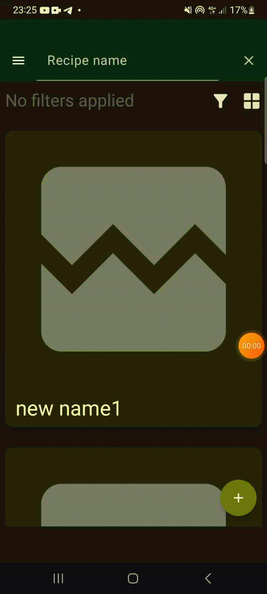

# Recipe Sharing (client)

**Table of Contents**
1. [Description](#description)
    * [Build-With](#build-with)
    * [Application-Work](#application-work)
    * [Installation](#installation)

### **Description**
Client sidde of recipe sharing system gives users opportunity to share recipes and search for them, using their mobile devices. Not that complex ui provide users whole database read-write functionality.

### **Build with:**
1. [![Android Studio][android-studio-img]][android-studio-url]

1. [![Kotlin][kotlin-img]][kotlin-url] (for android app)

1. [![Retrofit][retrofit-img]][retrofit-url]

1. [![Coil][coil-img]][coil-url]

1. [![Jetpack%20Compose][compose-img]][compose-url]


Client side of recipe sharing application uses retrofit service to access to server api endpoints. For each functional scope there is its own repository to call appropriate service functions. For example, AuthRepositoryImpl aimed to get, post and update reicpes.

```kotlin
class AuthRepositoryImpl(
    private val api : RecipesAPIService
) : IAuthRepository {
    override suspend fun register(login: String, password: String): AuthResult<String> {
        return try {
            api.signUp(AuthRequest(login, password))
            logIn(login, password)
        }
        catch (e : HttpException){
            AuthResult.Error(e.message)
        }
        catch (e : Exception){
            e.printStackTrace()
            AuthResult.Error(e.message)
        }
    }

    override suspend fun authorize(token: String): AuthResult<String> {
        return try {
            api.authorize(token)
            AuthResult.Authorized(null)
        }
        catch (e : HttpException){
            e.printStackTrace()
            AuthResult.Error(e.message)
        }
        catch (e : Exception){
            e.printStackTrace()
            AuthResult.Error(e.message)
        }

    }

    override suspend fun logIn(login: String, password: String): AuthResult<String> {
        return try {
            val data = api.signIn(AuthRequest(login, password))
            AuthResult.Authorized(data)
        }
        catch (e : HttpException){
            e.printStackTrace()
            AuthResult.Error(e.message)
        }
        catch (e : Exception){
            e.printStackTrace()
            AuthResult.Error(e.message)
        }
    }
}
```

***
### **Application work**

##### When app first launches it checks if user has already authorized and has his auth token. If user do not have one, he will be navigated to Login screen. After passing authorization, user will be redirected to recipes screen, where he can filter existing recipes by name or by filters.


##### And then, filter recipes


***

##### User can also add his own recipe, besides watching existing ones:


##### By the way, you can also edit already created recipes:


*** 

##### Users can also edit their info: set image and edit nickname.



***

### Installation
first clone repository branch
```
git clone https://github.com/Zeafen/Recipe-Sharing -b Client
```
then open it with Android studio, edit the connection string in ApplicationModule and replace SERVER_PORT and SERVER-IP with approptiate ones. The launch on device.


[kotlin-img]:https://img.shields.io/badge/kotlin-%237F52FF.svg?style=for-the-badge&logo=kotlin&logoColor=white
[kotlin-url]:https://kotlinlang.org/
[android-studio-img]: https://img.shields.io/badge/android%20studio-346ac1?style=for-the-badge&logo=android%20studio&logoColor=white
[android-studio-url]: https://developer.android.com/studio
[retrofit-img]: https://badge.ttsalpha.com/api?label=Retrofit&status=≥2.9.0&color=white&labelColor=green&style=for-the-badge
[retrofit-url]: https://square.github.io/retrofit/
[coil-img]: https://badge.ttsalpha.com/api?label=Coil&status=≥2.7.0&color=white&labelColor=blue&style=for-the-badge
[coil-url]: https://coil-kt.github.io/coil/
[compose-img]: https://img.shields.io/badge/Jetpack%20Compose-4285F4.svg?style=for-the-badge&logo=Jetpack-Compose&logoColor=white
[compose-url]: https://developer.android.com/compose
